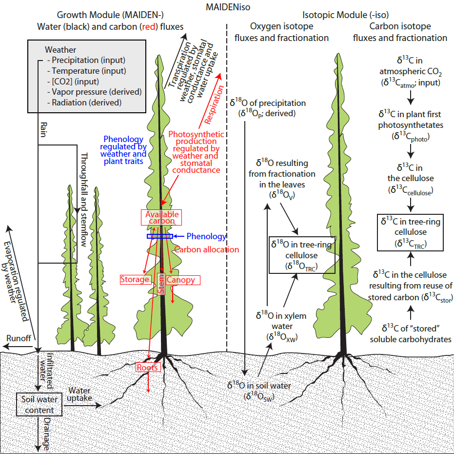

# Authors and developers

**Authors :**

Laurent Misson (MAIDEN)

Pierre-Alain Danis (isotopic module)

**Developers in alphabetical order :**

Etienne Boucher, UQAM, Canada

Guillermo Gea-Izquierdo, INIA, Spain

Fabio Gennaretti, UNIVPM, Italy and UQAT, Canada

Joël Guiot, CEREGE, France

Laia Andreu-Hayles, CREAF, Spain

Ignacio Hermoso, UQAM, Canada

Alienor Lavergne, Imperial College, UK

# Language

C++

# Spatial simulations

Possible but without interaction between pixels

# Spatial resolution

1 m² of forests

# Spatial scale

Average tree

# Spatial scale of outputs

Forest stand

# Temporal resolution

Daily

# Temporal scale of outputs

From daily to several decades

# Species

The model has already been used and tested for several temperate and Mediterranean species (Pinus spp., Quercus spp., Cedrus atlantica), and for alpine and boreal species from the northern and southern hemisphere (Picea mariana, Picea gluaca, Picea abies , Larix decidua, Pinus sylvestris, Nothofagus pumilio).

# Stand types

Mainly monospecific stands

# Evolution of the environment

Climate, CO2, δ13C of CO2

**Input climate data at daily time step** : year, Julian day, maximum temperature (°C), minimum temperature (°C), precipitation (cm), CO2 concentration in the atmosphere (ppm)

**Other input variables for the isotopic module** : δ18O of precipitation, δ13C of CO2

# Consideration of forest management

Resetting the stand parameters (i.e., LAI) is necessary after any forest management intervention

# Simulated processes

Transmission and absorption of solar radiation in the canopy

Water fluxes in the canopy and in the soil

Photosynthesis

Evapotranspiration

Phenology

Allocation of carbon to different tree compartments

Isotopic fractionations of carbon, oxygen and hydrogen

# Modeled traits

**Radiation** : LAI, coefficients for absorption and reflection of PAR

**Water fluxes in the canopy** : interception, maximum storage of water in the canopy

**Soil** : water infiltration, and thickness, grain size and percentage of roots in four soil layers

**GPP** : photosynthesis (De Pury and Farquhar) and stomatal conductance (Leuning)

**Isotopes** : multiple fractionations

**Phenology** : GDD for budburst, photoperiod for senescence

**C Allocation** : allometric coefficients and C partitioning according to the phenological phase

# Main outputs

**At daily resolution** : water transfers and budget, GPP, NPP, biomass allocated to specific compartments (trunk, roots, reserves, canopy), cellulose stable isotopes

# Average computation time

4 seconds per 100 years for a stand

# Deterministic or stochastic modeling

Deterministic

# Strengths and weaknesses

**Strengths** :

- Use of simple and easily measurable meteorological inputs

- Possible comparison with metrics that can be used by dendrochronologists (ring widths, wood density, isotopic ratios of cellulose)

- Consideration of sugar reserves (NSCs)

- Detailed simulation of C, water and energy fluxes

- The model has many parameters and it makes no sense to calibrate “blindly” (or just statistically) as many parameters as we want until we get a good calibration. A better approach is to set parameters accordingly to physiological knowledge and only calibrate a short list of them according to the goal of the simulation experiment.

**Weaknesses** :

- Lack of a cell differentiation module allowing dimensional comparison with tree-ring width

- Lack of modeling of stand ecological processes, including disturbance, mortality, dispersal and recruitment

- Lack of spatial interactions between tree individuals

# Most recent developments

Development of a snow accumulation and melting module contributing to the water and isotopic balance of the soil. In the past versions, the model only considers the snow cover in the modeling of the terrestrial albedo.

# MAIDEN-iso documentation

[MAIDENiso_Documentation.pdf (PDF)](documents/MAIDENiso_Documentation_20230207.pdf)

<h2>Comments and feedbacks</h2>

We encourage future users to give feedback, particularly when they find bugs or things to ameliorate in the model, documentation, and user’s manual. Current developers (see above) are available to discuss projects and simulation experiences using MAIDEN.

# Contacts, Social Media and News

📍 UNIVPM, Fabio Gennaretti

📧 f.gennaretti@univpm.it  

--------------------------

[Follow us on Facebook](https://www.facebook.com/)

